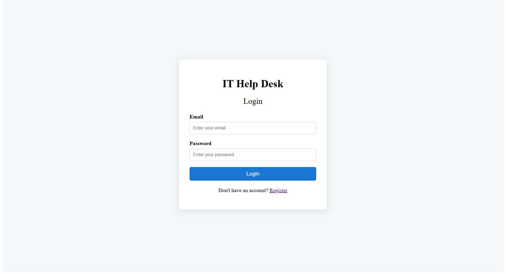
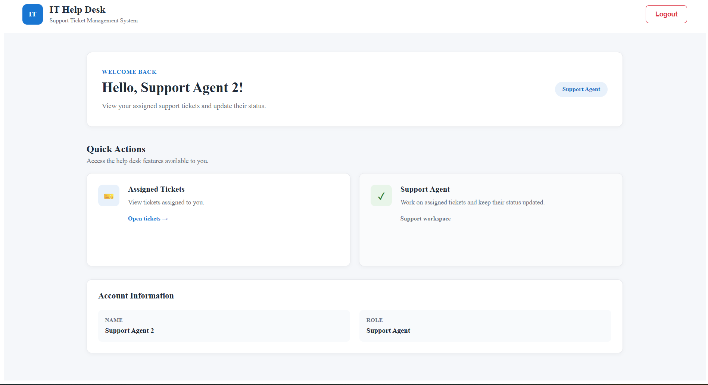
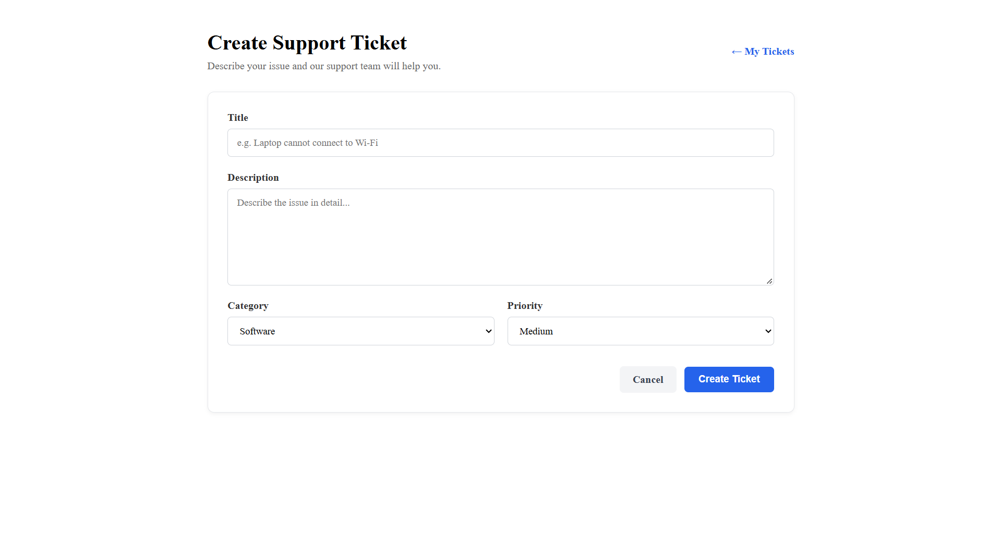
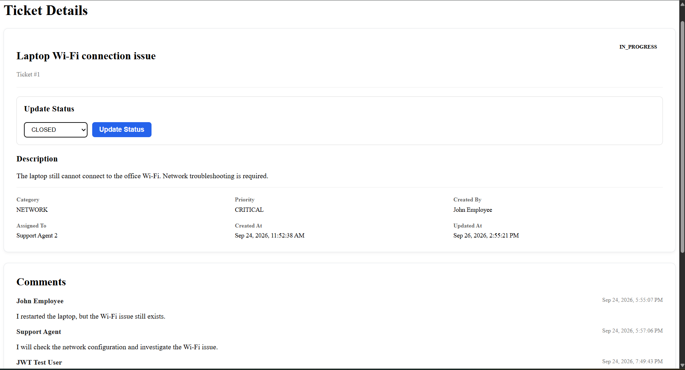
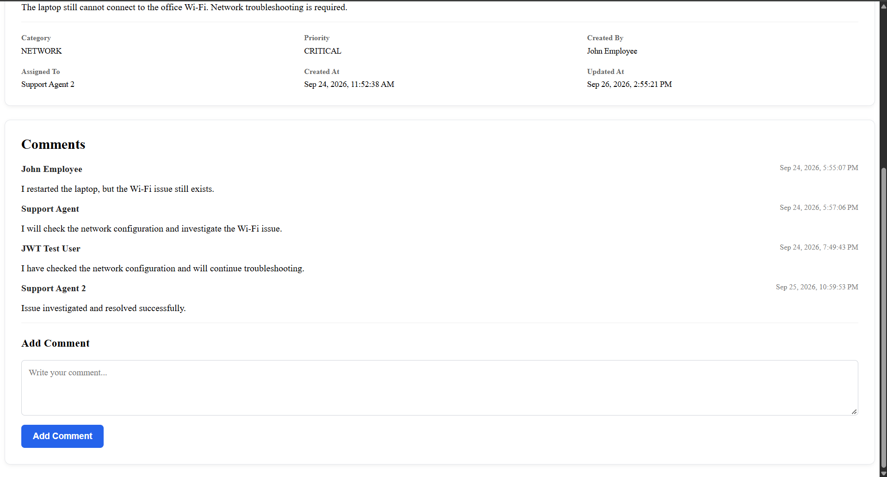

# IT Help Desk Ticketing System

A full-stack IT Help Desk Ticketing System built with **Spring Boot, REST APIs, Spring Security, JWT authentication, MySQL, Angular, and TypeScript**.

The application allows employees to create and track support tickets, while support agents can manage ticket status and administrators can assign tickets and manage users.

---

## Features

### Authentication & Security

* JWT-based authentication
* Secure password hashing using BCrypt
* Role-based authorization
* Employee registration
* Login and logout
* Protected API endpoints
* Angular authentication guard
* JWT HTTP interceptor

### Employee

* Register as an employee
* Login securely
* Create support tickets
* View their own tickets
* View ticket details
* Update eligible tickets
* Cancel eligible open tickets
* Add and view ticket comments
* Track ticket status

### Support Agent

* Login securely
* View tickets assigned to them
* View ticket details
* Add comments
* Update ticket status
* Manage tickets through the ticket lifecycle

### Administrator

* Login securely
* View tickets
* Assign tickets to support agents
* Manage users
* Create users with different roles
* View user information
* Manage ticket assignments

---

## Screenshots

### Login



### Dashboard



### Create Ticket



### Ticket Details



### Comments



---

## Ticket Workflow

```text
Employee
   |
   | Create Ticket
   v
OPEN
   |
   | Admin assigns agent
   v
ASSIGNED
   |
   | Agent starts work
   v
IN_PROGRESS
   |
   | Issue resolved
   v
RESOLVED
   |
   | Ticket closed
   v
CLOSED
```

Supported ticket statuses:

* OPEN
* ASSIGNED
* IN_PROGRESS
* RESOLVED
* CLOSED
* CANCELLED

---

## Roles

| Role     | Main Responsibilities                     |
| -------- | ----------------------------------------- |
| Employee | Create and track own support tickets      |
| Agent    | Handle assigned tickets and update status |
| Admin    | Manage users and assign tickets           |

---

## Technology Stack

### Backend

* Java 21
* Spring Boot
* Spring Security
* JWT
* Spring Data JPA
* Hibernate
* REST APIs
* Maven
* MySQL

### Frontend

* Angular
* TypeScript
* HTML
* CSS
* Angular Router
* Angular HTTP Client

### Database

* MySQL

### Development Tools

* Git
* GitHub
* Postman
* Visual Studio Code / IntelliJ IDEA

---

## Project Structure

```text
HELPDESK-TICKETING-SYSTEM/
│
├── backend/
│   ├── src/
│   │   ├── main/
│   │   │   ├── java/com/surendar/helpdesk/
│   │   │   │   ├── config/
│   │   │   │   ├── controller/
│   │   │   │   ├── dto/
│   │   │   │   ├── entity/
│   │   │   │   ├── exception/
│   │   │   │   ├── repository/
│   │   │   │   └── service/
│   │   │   └── resources/
│   │   └── test/
│   ├── pom.xml
│   ├── mvnw
│   └── mvnw.cmd
│
├── frontend/
│   ├── src/
│   │   └── app/
│   │       ├── core/
│   │       └── pages/
│   ├── package.json
│   ├── angular.json
│   └── tsconfig.json
│
├── screenshots/
│   ├── login.png
│   ├── dashboard.png
│   ├── create-ticket.png
│   ├── ticket-details.png
│   └── comments.png
│
├── LICENSE
├── .gitignore
└── README.md
```

---

# Getting Started

## Prerequisites

Install the following before running the application:

* Java 21
* MySQL
* Node.js
* Angular CLI
* Git

Verify the installations:

```bash
java -version
mvn -version
node -v
npm -v
ng version
```

---

# Database Setup

Start MySQL and create the database:

```sql
CREATE DATABASE helpdesk_db;
```

The Spring Boot application uses Hibernate to create and update the required database tables automatically.

Main entities include:

* Users
* Tickets
* Comments

---

# Environment Variables

Database credentials and the JWT secret are **not stored in the repository**.

The backend uses:

```properties
spring.datasource.password=${DB_PASSWORD}
jwt.secret=${JWT_SECRET}
```

Set the required environment variables before starting the backend.

### Windows CMD

```cmd
set DB_PASSWORD=YOUR_MYSQL_PASSWORD
set JWT_SECRET=YOUR_JWT_SECRET
```

Do not commit your real password or JWT secret to GitHub.

---

# Running the Backend

Open a terminal in the project root:

```cmd
cd backend
```

Set the environment variables:

```cmd
set DB_PASSWORD=YOUR_MYSQL_PASSWORD
set JWT_SECRET=YOUR_JWT_SECRET
```

Start Spring Boot:

```cmd
mvnw.cmd spring-boot:run
```

The backend runs on:

```text
http://localhost:8080
```

---

# Running the Frontend

Open another terminal:

```cmd
cd frontend
```

Install dependencies:

```cmd
npm install
```

Start Angular:

```cmd
ng serve
```

The frontend runs on:

```text
http://localhost:4200
```

Open the application in your browser:

```text
http://localhost:4200
```

---

# REST API

## Authentication

### Employee Registration

```http
POST /api/auth/register
```

### Login

```http
POST /api/auth/login
```

---

## Tickets

### Create Ticket

```http
POST /api/tickets
```

### Get Tickets

```http
GET /api/tickets
```

### Get Ticket by ID

```http
GET /api/tickets/{id}
```

### Update Ticket

```http
PUT /api/tickets/{id}
```

### Assign Ticket

```http
PUT /api/tickets/{id}/assign/{agentId}
```

### Update Ticket Status

```http
PUT /api/tickets/{id}/status
```

---

## Users

Administrative user management endpoints:

```http
POST /api/users
```

```http
GET /api/users
```

```http
GET /api/users/{id}
```

These endpoints require administrator authorization.

---

## Comments

Ticket comments are supported through the comment API and are protected according to the user's role and ticket access.

---

# Security

The application implements several security mechanisms:

* JWT authentication
* BCrypt password hashing
* Stateless Spring Security sessions
* Role-based authorization
* Protected REST endpoints
* Angular route guards
* JWT authorization interceptor
* Employee-only public registration
* Administrator-only user management
* Ticket ownership checks

Sensitive configuration values are supplied through environment variables instead of being committed to source control.

---

# Example Application Flow

```text
1. Employee registers
        |
        v
2. Employee logs in
        |
        v
3. Employee creates a support ticket
        |
        v
4. Administrator assigns the ticket
        |
        v
5. Support agent works on the ticket
        |
        v
6. Agent updates ticket status
        |
        v
7. Employee tracks the ticket
        |
        v
8. Ticket is resolved and closed
```

---

# Future Enhancements

Possible future improvements include:

* Email notifications
* Ticket search and filtering
* Pagination
* Dashboard statistics
* File attachments
* Ticket priority-based filtering
* Advanced admin dashboard
* Automated deployment
* Docker support
* Cloud deployment

---

# Author

**Surendar D.**

B.Tech — 2026

Chennai, India

---

# License

Copyright (c) 2026 Surendar D.
All rights reserved.

This project is provided for portfolio and educational viewing purposes.

Please see the [`LICENSE`](LICENSE) file for the complete copyright notice and usage restrictions.

---

## Repository

GitHub:

https://github.com/surendar-024/HELPDESK-TICKETING-SYSTEM
